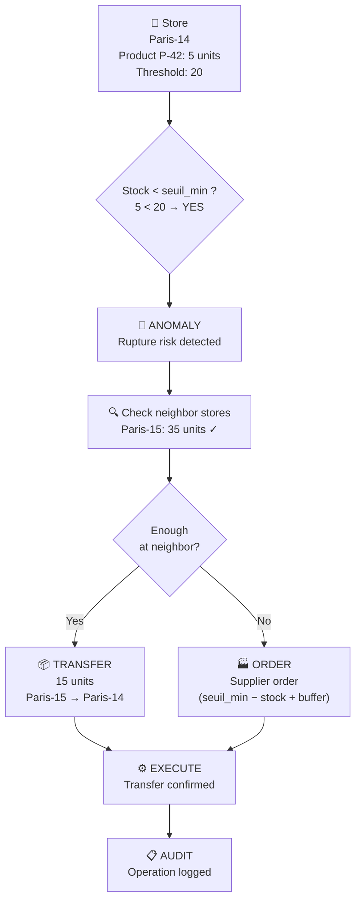
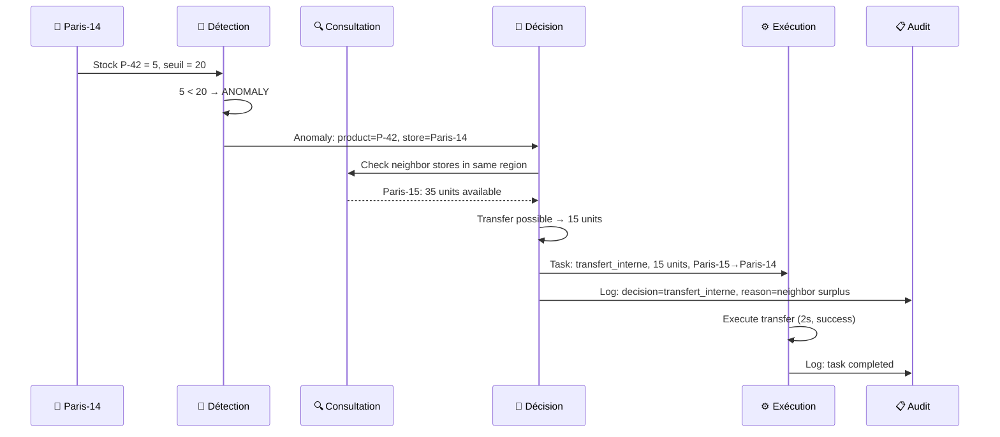
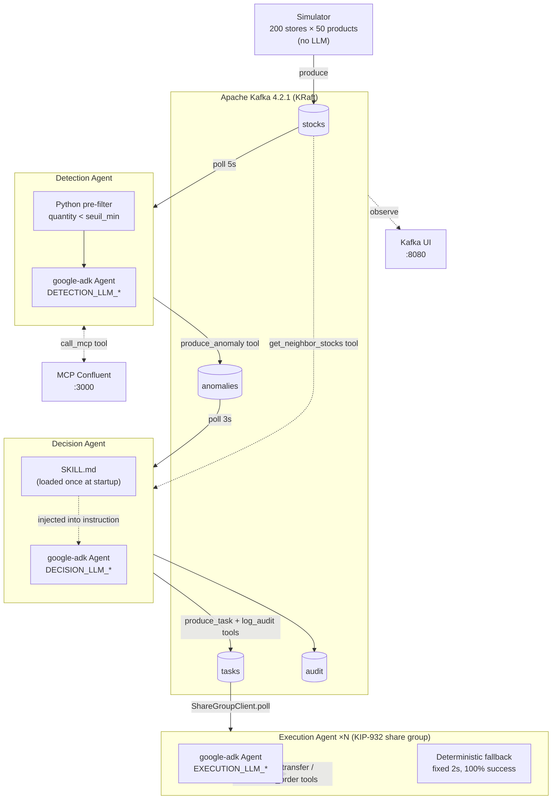
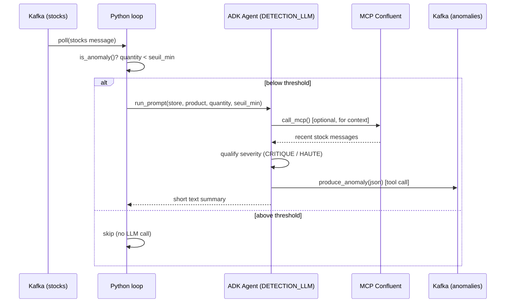
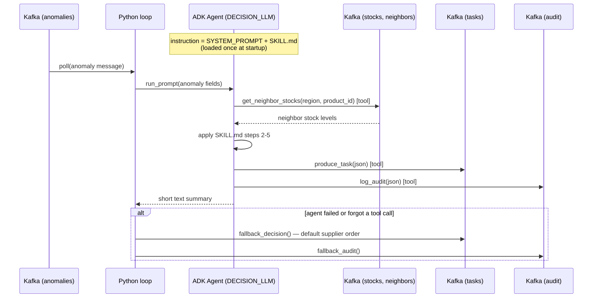
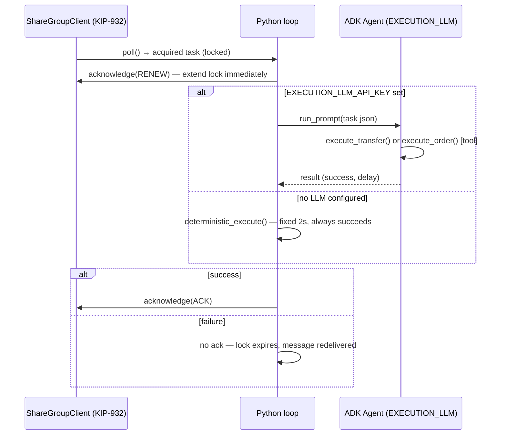

# Kafka Retail Agents PoC — Kafka as an Agent-Native Platform

[](https://kafka.apache.org/)
[](https://www.python.org/)
[](https://pypi.org/project/google-adk/)
[](https://docs.docker.com/compose/)

A proof-of-concept demonstrating how **Apache Kafka can serve as a native platform for AI agents** — three real [google-adk](https://pypi.org/project/google-adk/) agents, each free to run a different LLM provider, cooperating over Kafka topics to run a retail replenishment pipeline end to end.

> Article: [Kafka remplace vos middlewares — une supply chain de 200 magasins pilotée par 3 agents IA]([[https://blog.dolizone.com](https://kafblog.dolizone.com/blog/kafka-agents-supply-chain)]([https://kafblog.dolizone.com/](https://kafblog.dolizone.com/blog/kafka-agents-supply-chain)))

---

## Use Case: Retail Replenishment Pipeline

A distributor operates **200 stores** across multiple regions, each carrying up to **50 products**. Every product has a **minimum stock threshold** (`seuil_min`) per store — below this level, the shelf risks going empty before the next delivery window.

When stock dips below the threshold, the system must detect the anomaly, decide whether to **transfer inventory from a neighboring store** (faster, cheaper) or **place a supplier order** (slower, higher volume), execute the task, and log everything for audit.

### Business Flow



### Functional Walkthrough



**Key business rules** (defined in [`SKILL.md`](skills/supply-chain-replenishment/SKILL.md)):
1. Identify the product and store from the anomaly
2. Check stock levels at neighboring stores in the same region
3. If a neighbor has enough surplus → **internal transfer** (avoid supplier cost + delay)
4. If no neighbor can help → **supplier order** (quantity = seuil_min − current stock + 10% buffer)
5. For perishable products, add an extra 10% buffer for waste
6. Log every decision to the audit topic for traceability

The **detection threshold** is configurable via `STOCK_ALERT_THRESHOLD_RATIO` (default: 1.0). Setting it to 0.8 means the alert fires when stock falls below 80% of the product's `seuil_min` — useful for early-warning scenarios.

---

## Architecture



**Pipeline flow:**

1. **Simulator** → publishes synthetic stock levels (and orders) to the `stocks` topic every cycle — no LLM involved.
2. **Detection Agent** → a fast Python pre-filter (`quantity < seuil_min`) decides which of the ~10,000 stock messages/cycle are worth escalating; only those go through the real ADK agent, which qualifies severity and publishes to `anomalies` itself via its `produce_anomaly` tool.
3. **Decision Agent** → reads `anomalies`, applies the `SKILL.md` procedure (injected into its instruction at startup), checks neighbor stocks, and publishes both a `tasks` entry and an `audit` entry via its own tools.
4. **Execution Agent ×N** → cooperative consumption of `tasks` via KIP-932 Share Groups; executes (LLM-backed or deterministic) and acknowledges.

---

## Why the LLM only sees pre-filtered anomalies

The simulator writes ~10,000 stock messages per cycle (200 stores × 50 products). Calling an LLM on every single one would be slow and needlessly expensive for a PoC. So the rule `quantity < seuil_min` stays where it belongs — in plain, free, instant Python — and only runs the ADK agent on messages that already cleared that bar. The agent's job is to **qualify** the anomaly (severity, type) and **decide to publish it**, not to scan the firehose.

---

## Sequence per agent

### Detection Agent



### Decision Agent



### Execution Agent



---

## The 3 Pillars

This PoC is built around three key Kafka capabilities that make it an ideal platform for agent-native architectures:

### 1. MCP Confluent — LLMs Query Kafka Natively

The [MCP Confluent](https://github.com/confluentinc/mcp-confluent) bridge exposes Kafka as a tool that LLMs can call directly (`consume-messages`, `list-topics`, `get-topic-config`, `get-consumer-group-lag`). The Detection Agent calls it through its `call_mcp` ADK tool — no custom API layer, the agent talks the same Kafka protocol as everything else.

### 2. Agent Skills — Business Logic via SKILL.md

The Decision Agent's behavior is driven by a plain-text [`SKILL.md`](skills/supply-chain-replenishment/SKILL.md) file — a declarative, 6-step specification of the replenishment procedure, read **once at startup** and injected straight into the ADK agent's `instruction`:

- **Human-readable**: business stakeholders can audit and modify agent behavior without touching code
- **Version-controlled**: skills live in Git alongside code — full change history and review
- **Redeploy to update**: restart `decision-agent` to pick up a new `SKILL.md` revision

### 3. KIP-932 Share Groups — Cooperative Consumption with ACK/Retry

> **⚠️ Important — Why this PoC emulates KIP-932 instead of using the native `ShareConsumer`**
>
> `confluent-kafka-python` **2.15.0** (released 2026) ships a `ShareConsumer` class in **Preview** mode that exposes KIP-932 natively.
> This PoC nevertheless uses an **application-layer emulator** ([`share_group_client.py`](agents/common/share_group_client.py)) instead.
> Here is why.

Execution agents consume the `tasks` topic using [KIP-932](https://cwiki.apache.org/confluence/display/KAFKA/KIP-932%3A+Queues+for+Kafka) share group semantics. [`share_group_client.py`](agents/common/share_group_client.py) wraps a standard `Consumer` with an **application-layer emulation** of the KIP-932 state machine — per-message locks, ACK/RENEW/RELEASE lifecycle, lock expiry, and dead-letter after max delivery attempts:

- **Cooperative consumption**: partitions are distributed by Kafka's native consumer group protocol; the emulation adds per-message locking on top so tasks aren't processed by two agents simultaneously
- **ACK-based delivery**: tasks are only marked complete when the agent calls `acknowledge(ACK)` — the standard consumer offset is committed only then
- **Auto-reassignment**: if an agent crashes without ACKing, the lock expires (30s default) and the message becomes `AVAILABLE` again for any agent in the group
- **Dead-letter**: after `max_delivery_attempts` failed deliveries, the task is silently dropped with a log warning
- **Linear scalability**: `docker compose up -d --scale execution-agent=N` — new agents join the consumer group and immediately receive partitions

#### Obstacles to using the native `ShareConsumer` today

Two concrete blockers prevent adopting the native Python `ShareConsumer` (v2.15.0 Preview) in this PoC right now:

**A. Missing `RENEW` action in the Python client — the LLM lock problem**

In the native Java `KafkaShareConsumer`, you can call `acknowledge(record, AcknowledgeType.RENEW)` to extend the acquisition lock while a long-running operation (e.g. an LLM call taking 5–15 seconds) is in flight. The Python `ShareConsumer` (2.15.0 Preview) only exposes `ACCEPT` (ACK) and `RELEASE`/`REJECT` — there is no way to renew a lock dynamically from Python.

- **Risk**: if the LLM is slow, the broker-side lock expires before the agent finishes responding, triggering a **duplicate execution** of the task by another agent.
- **Workaround**: set an arbitrarily long lock duration (e.g. 60s) at the broker level — but this delays recovery in case of a real crash, defeating the purpose of cooperative consumption.

**B. librdkafka binary wheels and build time**

The Python client is a C wrapper around `librdkafka`. Preview releases like 2.15.0 don't always ship pre-compiled wheels for every architecture (notably Apple Silicon M1/M2/M3 and ARM64 Linux). Without a wheel, `pip install` falls back to compiling `librdkafka` from source — requiring `gcc`, `g++`, `make` and adding 10–15 minutes to the Docker build.

#### Consequences of switching to the native `ShareConsumer`

| | Impact |
|---|---|
| ✅ **Zero emulation code** | Delete `share_group_client.py` and the local JSON persistence files (`/tmp/share-group-*.json`) |
| ✅ **Protocol fidelity** | The PoC exercises the real KIP-932 network protocol, not an approximation |
| ✅ **Distributed state** | Delivery state lives in the broker's memory, not on the container's local disk — survives container recreation |
| ❌ **Loss of cloud portability** | Most managed Kafka services (AWS MSK, Confluent Cloud, Aiven) haven't enabled share groups in production yet — the PoC would be strictly limited to a local Kafka 4.2+ Docker setup |
| ❌ **API instability** | The `ShareConsumer` interface is in Preview — minor version bumps of `confluent-kafka` may break the API without notice |
| ❌ **Offline testing breaks** | The deterministic test suite (`test_deterministic_flow.py`) runs without any Docker container. `ShareConsumer` opens native C sockets via `librdkafka` at instantiation — making it impossible to test offline without heavy mocking of the C library |

#### Conclusion

This PoC is a **demonstration and learning tool**. Its goal is to show how three AI agents cooperate over Kafka using KIP-932 semantics — anywhere, including offline on a laptop. Until `confluent-kafka-python` reaches **GA** for the `ShareConsumer` (with `RENEW` support), the emulator reproduces the KIP-932 lifecycle faithfully: `AVAILABLE → ACQUIRED → ACKNOWLEDGED`, lock expiry, delivery counting, and dead-letter — without the build, cloud, and testing constraints of the Preview native client.

The public API (`poll()`, `acknowledge()`, `release()`) is designed to mirror the native `ShareConsumer`, so the swap will be a drop-in replacement when the time comes.

---

## Real ADK agents, one LLM provider per agent

Every agent (`detection`, `decision`, and `execution`) is a real `google.adk.Agent` run through a `google.adk.Runner` — never a hand-rolled HTTP call to a provider API. [`agents/common/adk_factory.py`](agents/common/adk_factory.py) builds the model for any of the three agents from **three independent env var blocks**, so each agent can use a different provider and model:

```python
def create_llm(provider: str, model: str, api_key: str):
    if provider == "openai":
        return LiteLlm(model=f"openai/{model}", api_key=api_key)
    if provider == "anthropic":
        return LiteLlm(model=f"anthropic/{model}", api_key=api_key)
    if provider == "gemini":
        return LiteLlm(model=f"gemini/{model}", api_key=api_key)
    raise ValueError(f"Unknown LLM provider: {provider}")
```

All three providers are routed through [LiteLLM](https://docs.litellm.ai/) — there's no provider-specific SDK wiring, no separate `AnthropicLlm`/`Claude` branch, and no OpenAI-only payload assumption baked into the code.

```env
# Detection Agent — OPTIONAL
DETECTION_LLM_PROVIDER=openai
DETECTION_LLM_MODEL=gpt-4o
DETECTION_LLM_API_KEY=*** empty = deterministic, no LLM call at all

# Decision Agent — OPTIONAL
DECISION_LLM_PROVIDER=anthropic
DECISION_LLM_MODEL=claude-sonnet-4-20250514
DECISION_LLM_API_KEY=*** empty = deterministic, no LLM call at all

# Execution Agent — OPTIONAL
EXECUTION_LLM_PROVIDER=gemini
EXECUTION_LLM_MODEL=gemini-2.5-pro
EXECUTION_LLM_API_KEY=*** empty = deterministic, no LLM call at all
```

**All three agents are runnable with zero LLM keys.** Each one follows the same principle: if its `*_LLM_API_KEY` is empty, no `AdkAgentRunner` is ever instantiated — the agent falls back to a fixed, deterministic path instead of calling out to a provider:

- **Detection without a key**: the deterministic pre-filter (`quantity < seuil_min`) still runs on every stock message. Each candidate is published straight to `anomalies` as a basic, unqualified anomaly (`type_anomalie=rupture_stock`, `severity=WARNING`) — no LLM severity qualification.
- **Decision without a key**: every anomaly gets the default rule-based outcome — a supplier order (`commande_fournisseur`) sized off `seuil_min`/`current_quantity`, published as a task plus an audit log entry with `raison` explaining it's a deterministic fallback.
- **Execution without a key**: fully deterministic — fixed 2-second delay, 100% success, zero randomness.

This keeps the demo runnable end-to-end without paying for any LLM provider, and you can enable qualification/reasoning selectively per agent by setting only the keys you want.

---

## Quickstart

### Prerequisites

- Docker & Docker Compose v2
- LLM API keys are optional for all three agents — leave any `*_LLM_API_KEY` empty to run that agent on its deterministic fallback instead

### Setup

```bash
# 1. Clone the repository
git clone https://github.com/arabaaoui/kafka-for-agents.git kafka-retail-agents-poc
cd kafka-retail-agents-poc

# 2. Create your environment file
cp .env.example .env

# 3. Edit .env — set any/all of DETECTION_LLM_API_KEY, DECISION_LLM_API_KEY,
#    EXECUTION_LLM_API_KEY (all optional; empty = deterministic fallback)
vim .env

# 4. Start the full pipeline
docker compose up -d
```

The pipeline is now running! Visit [Kafka UI](http://localhost:8080) to explore topics and messages in real time.

---

## Demo Scripts

Three self-contained demo scripts showcase the platform's capabilities:

### Demo 1 — Full Pipeline

```bash
./scripts/demo-1-full-pipeline.sh
```

Starts all services, waits for Kafka initialization, and shows the complete 3-agent pipeline flowing:

- Simulator generates stock levels
- Detection agent (ADK) qualifies and publishes anomalies
- Decision agent (ADK) creates tasks via `SKILL.md`
- Execution agent processes tasks into audit records

### Demo 2 — Horizontal Scaling

```bash
./scripts/demo-2-scale.sh
```

Demonstrates KIP-932 Share Group scaling:

- Shows the single execution agent running
- Scales to 5 agents: `docker compose up -d --scale execution-agent=5`
- Watches logs showing cooperative task consumption across all 5 agents

### Demo 3 — Crash Recovery

```bash
./scripts/demo-3-crash.sh
```

Demonstrates automatic failure recovery:

- Lists running execution agents
- Force-kills one container (`docker kill`)
- Shows unacknowledged tasks being automatically reassigned to remaining agents
- Pipeline continues without data loss or manual intervention

---

## Development & Testing

For local development, the stack can be split into two independent Compose files sharing an external Docker network — a standalone test Kafka cluster (`docker-compose.test.yml`) and the application services (`docker-compose.app.yml`). This lets you restart the agents without tearing down (or losing data in) the Kafka broker, and vice versa.

| File | Contains | Kafka port |
|------|----------|------------|
| `docker-compose.test.yml` | Standalone Kafka 4.2.1 (KRaft, 1 broker) + topic init (`orders`, `stocks`, `anomalies`, `tasks`, `audit`) + Kafka UI (`:8081`) + `kcat` one-shot topic summary | `9093` |
| `docker-compose.app.yml` | `mcp-confluent`, `simulator`, `detection-agent`, `decision-agent`, `execution-agent` (no Kafka) | — (connects to `kafka:9093`) |

Both files attach to a shared external network, `kafka-retail-test`, so the app services resolve the test broker by its service name (`kafka`).

### Makefile targets

```bash
make test-stack   # start the standalone test Kafka cluster (port 9093)
make app          # start the app services against the test cluster
make all          # test-stack + app in one go
make demo-1       # all + run the full pipeline demo
make demo-2       # horizontal scaling demo (1→5 agents)
make demo-3       # crash recovery demo
make logs         # follow app service logs
make logs-test    # follow Kafka test cluster logs
make check        # pipeline health: consumer groups, message counts, recent anomalies/tasks
make monitor      # follow app agent logs + Kafka UI logs together
make topics       # show topic/partition state via docker exec
make local-test   # run the local Python deterministic-flow test, no Docker/LLM required
make stop-app     # stop the app services
make stop-test    # stop the test Kafka cluster
make clean        # stop everything and remove the test Kafka volume
make clean-all    # clean + remove the shared kafka-retail-test network
```

`make test-stack` creates the `kafka-retail-test` network if it doesn't already exist and prints the Kafka UI URL (http://localhost:8081, on a different port from the main stack's `:8080` to avoid conflicts). This test setup is entirely independent from the main `docker-compose.yml` stack (different Kafka port, different network) — the two can coexist without conflicting.

### Monitoring the pipeline

Kafka UI (`http://localhost:8081`) gives you real-time visibility into topics, messages, and consumer groups. For command-line checks:

```bash
make check     # consumer groups state, message counts per topic, recent anomalies/tasks
make logs      # live agent output: [DETECTION], [DECISION], [EXECUTION]
make topics    # partition layout and replication for each topic
```

A healthy pipeline shows messages flowing through all 5 topics (`stocks` → `anomalies` → `tasks`/`audit`) with consumer group lags staying near zero.

---

## Project Structure

```
kafka-retail-agents-poc/
├── .env.example                      # Environment variable template (3 LLM blocks)
├── docker-compose.yml                # Complete stack definition
├── docker-compose.test.yml           # Standalone test Kafka cluster (port 9093)
├── docker-compose.app.yml            # App services only, connects to the test cluster
├── Makefile                          # Dev workflow targets (test-stack, app, local-test, ...)
├── PLAN.md                           # Implementation plan / design notes
├── scripts/
│   ├── demo-1-full-pipeline.sh       # Full pipeline startup demo
│   ├── demo-2-scale.sh               # Horizontal scaling demo
│   └── demo-3-crash.sh               # Crash recovery demo
├── skills/
│   └── supply-chain-replenishment/
│       └── SKILL.md                  # Business rules (Agent Skill) — Decision Agent
├── mcp-confluent/
│   ├── Dockerfile
│   ├── package.json
│   └── server.js                     # MCP server exposing Kafka tools (KafkaJS)
├── tests/
│   └── test_deterministic_flow.py    # Local test of the deterministic flow, no Docker/LLM
└── agents/
    ├── Dockerfile.agent              # Shared image for simulator + 3 agents
    ├── common/
    │   ├── config.py                 # Env-driven config, 3 LLM blocks
    │   ├── adk_factory.py            # LiteLLM-backed google-adk Agent factory + runner
    │   ├── share_group_client.py     # KIP-932 emulator (ACK/RENEW/RELEASE, dead-letter)
    │   └── requirements.txt
    ├── simulator/
    │   └── app.py                    # Synthetic stock/order generator (no LLM)
    ├── detection/
    │   ├── agent.py                  # Pre-filter + ADK Agent (produce_anomaly tool)
    │   └── prompts.py
    ├── decision/
    │   ├── agent.py                  # ADK Agent (get_neighbor_stocks, produce_task, log_audit)
    │   └── prompts.py
    └── execution/
        ├── agent.py                  # ShareGroupClient consumer + optional ADK Agent
        └── prompts.py
```

---

## Configuration Reference

| Variable | Required | Default | Description |
|----------|----------|---------|-------------|
| `DETECTION_LLM_PROVIDER` | No | `openai` | `openai` \| `anthropic` \| `gemini` |
| `DETECTION_LLM_MODEL` | No | `gpt-4o` | Model name |
| `DETECTION_LLM_API_KEY` | No | *(empty)* | Leave empty for deterministic detection (basic anomaly, no severity qualification) |
| `DECISION_LLM_PROVIDER` | No | `anthropic` | `openai` \| `anthropic` \| `gemini` |
| `DECISION_LLM_MODEL` | No | `claude-sonnet-4-20250514` | Model name |
| `DECISION_LLM_API_KEY` | No | *(empty)* | Leave empty for deterministic decision (default supplier order) |
| `EXECUTION_LLM_PROVIDER` | No | *(empty)* | `openai` \| `anthropic` \| `gemini` |
| `EXECUTION_LLM_MODEL` | No | *(empty)* | Model name |
| `EXECUTION_LLM_API_KEY` | No | *(empty)* | Leave empty for deterministic execution (fixed 2s, 100% success) |
| `KAFKA_BOOTSTRAP_SERVERS` | No | `kafka:9092` | Kafka broker address |
| `MCP_CONFLUENT_URL` | No | `http://mcp-confluent:3000` | MCP Confluent HTTP endpoint |
| `SHARE_GROUP_LOCK_DURATION_MS` | No | `30000` | KIP-932 lock duration before a task is redelivered |
| `SHARE_GROUP_MAX_DELIVERY_ATTEMPTS` | No | `5` | Attempts before a task is dead-lettered |
| `SIMULATION_SPEED` | No | `1.0` | `1.0` = real-time, `60.0` = 1h of data in 1 minute |
| `STOCK_ALERT_THRESHOLD_RATIO` | No | `1.0` | Ratio applied to each product's `seuil_min` to decide when it's an anomaly. `1.0` = alert exactly at `seuil_min`, `0.8` = alert only once stock < 80% of `seuil_min` |

---

## Requirements

- **Docker** 24+ (with Docker Compose v2)
- **Python 3.11** (for local development; not required for Docker-only usage)
- **Two LLM API keys minimum** (Detection + Decision) — any of OpenAI, Anthropic, or Gemini
- **~4 GB RAM** available for the full stack

---

## License

MIT
